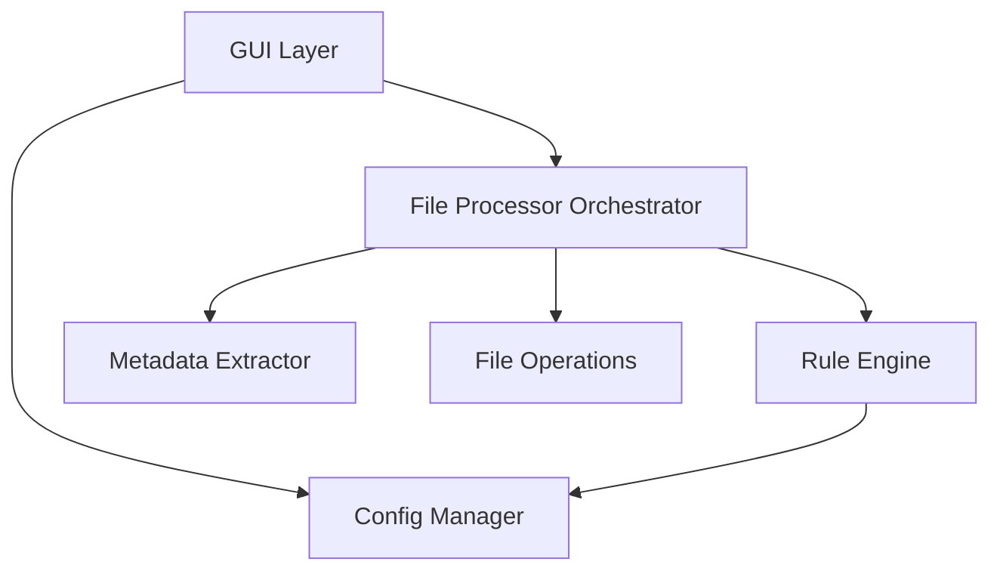

# 設計書

## 概要

ファイル仕訳け君は、Tauri 2.xとRust+TypeScriptで実装されるクロスプラットフォームGUIアプリケーションです。ファイルのメタデータ（EXIF情報、ファイルシステム属性）を読み取り、ユーザー定義のルールに基づいてファイルを自動的に整理します。

### 技術スタック

- **バックエンド言語**: Rust 1.91+
- **フロントエンド言語**: TypeScript
- **フレームワーク**: Tauri 2.x (クロスプラットフォーム対応)
- **UIライブラリ**: React + TypeScript
- **設定管理**: toml crate
- **EXIF読み取り**: kamadak-exif crate
- **ログ**: tracing crate

### アーキテクチャの原則

- レイヤードアーキテクチャ（プレゼンテーション層、ビジネスロジック層、データアクセス層）
- 依存性の逆転（インターフェースを使用した疎結合）
- 単一責任の原則（各コンポーネントは1つの責務のみ）

## アーキテクチャ

```
┌─────────────────────────────────────────┐
│         プレゼンテーション層              │
│  (React + TypeScript, ドラッグ&ドロップ)  │
└──────────────┬──────────────────────────┘
               │ Tauri IPC
┌──────────────▼──────────────────────────┐
│         ビジネスロジック層 (Rust)         │
│  (ルールエンジン、ファイル処理オーケストレーター) │
└──────────────┬──────────────────────────┘
               │
┌──────────────▼──────────────────────────┐
│         データアクセス層 (Rust)           │
│  (メタデータ抽出、ファイル操作、設定管理)  │
└─────────────────────────────────────────┘
```

### コンポーネント図



## コンポーネントとインターフェース

### 1. プレゼンテーション層（React + TypeScript）

#### MainWindow Component
メインウィンドウを管理し、設定画面とドロップゾーンを提供します。

```typescript
interface MainWindowProps {
  config: Config;
  onFileDrop: (files: string[]) => void;
}

const MainWindow: React.FC<MainWindowProps> = ({ config, onFileDrop }) => {
  // ドラッグ&ドロップハンドラー
  // 進捗表示
  // 設定画面の表示/非表示
}
```

#### SettingsPanel Component
ルールの追加、編集、削除、並び替えを行うUIコンポーネント。

```typescript
interface SettingsPanelProps {
  rules: Rule[];
  onAddRule: (rule: Rule) => void;
  onEditRule: (index: number, rule: Rule) => void;
  onDeleteRule: (index: number) => void;
  onReorderRules: (from: number, to: number) => void;
}

const SettingsPanel: React.FC<SettingsPanelProps> = ({ ... }) => {
  // ルール管理UI
}
```

#### ConflictDialog Component
ファイル上書き時の確認ダイアログ。

```typescript
enum ConflictResolution {
  Overwrite,
  Skip,
  Rename,
  OverwriteAll,
  SkipAll,
  RenameAll,
}

interface ConflictDialogProps {
  sourceFile: FileInfo;
  destFile: FileInfo;
  onResolve: (resolution: ConflictResolution, applyToAll: boolean) => void;
}

const ConflictDialog: React.FC<ConflictDialogProps> = ({ ... }) => {
  // 競合解決UI
}
```

#### Tauri Commands（TypeScript側）

```typescript
import { invoke } from '@tauri-apps/api/tauri';

// ファイル処理の開始
async function processFiles(files: string[]): Promise<ProcessResult[]> {
  return await invoke('process_files', { files });
}

// 設定の読み込み
async function loadConfig(): Promise<Config> {
  return await invoke('load_config');
}

// 設定の保存
async function saveConfig(config: Config): Promise<void> {
  return await invoke('save_config', { config });
}
```

### 2. ビジネスロジック層（Rust）

#### FileProcessor
ファイル処理のオーケストレーション。

```rust
pub struct FileProcessor {
    rule_engine: RuleEngine,
    metadata_extractor: Box<dyn MetadataExtractor>,
    file_ops: Box<dyn FileOperations>,
    conflict_policy: Option<ConflictResolution>,
}

impl FileProcessor {
    pub fn process_files(&mut self, files: Vec<String>) -> Vec<ProcessResult>;
    pub fn process_file(&mut self, file: &str) -> ProcessResult;
}
```

#### RuleEngine
ルールのマッチングと適用。

```rust
pub struct RuleEngine {
    rules: Vec<Rule>,
}

impl RuleEngine {
    pub fn find_matching_rule(&self, metadata: &FileMetadata) -> Option<&Rule>;
    pub fn apply_rule(&self, rule: &Rule, metadata: &FileMetadata) -> Result<String, String>;
}
```

#### Rule
整理ルールの定義。

```rust
#[derive(Debug, Clone, Serialize, Deserialize)]
pub struct Rule {
    pub id: String,
    pub name: String,
    pub priority: i32,
    pub conditions: Vec<Condition>,
    pub destination_pattern: String,
    pub operation: OperationType,
}

#[derive(Debug, Clone, Serialize, Deserialize)]
pub enum OperationType {
    Move,
    Copy,
}

#[derive(Debug, Clone, Serialize, Deserialize)]
pub struct Condition {
    pub field: String,
    pub operator: String,
    pub value: serde_json::Value,
}
```

### 3. データアクセス層（Rust）

#### MetadataExtractor
ファイルからメタデータを抽出するトレイト。

```rust
pub trait MetadataExtractor: Send + Sync {
    fn extract(&self, filepath: &str) -> Result<FileMetadata, String>;
}

#[derive(Debug, Clone, Serialize, Deserialize)]
pub struct FileMetadata {
    // ファイルシステム属性
    pub filename: String,
    pub extension: String,
    pub size: u64,
    pub created_at: Option<SystemTime>,
    pub modified_at: SystemTime,
    
    // EXIF情報（画像ファイルの場合）
    pub capture_date: Option<SystemTime>,
    pub camera_model: Option<String>,
    pub gps_latitude: Option<f64>,
    pub gps_longitude: Option<f64>,
}

pub struct DefaultMetadataExtractor;

impl MetadataExtractor for DefaultMetadataExtractor {
    fn extract(&self, filepath: &str) -> Result<FileMetadata, String>;
}
```

#### FileOperations
ファイル操作のトレイト。

```rust
pub trait FileOperations: Send + Sync {
    fn move_file(&self, source: &str, dest: &str) -> Result<(), String>;
    fn copy_file(&self, source: &str, dest: &str) -> Result<(), String>;
    fn exists(&self, path: &str) -> bool;
    fn create_dir(&self, path: &str) -> Result<(), String>;
    fn get_file_info(&self, path: &str) -> Result<FileInfo, String>;
}

#[derive(Debug, Clone, Serialize, Deserialize)]
pub struct FileInfo {
    pub name: String,
    pub size: u64,
    pub mod_time: SystemTime,
}

pub struct DefaultFileOperations;

impl FileOperations for DefaultFileOperations {
    // 実装
}
```

#### ConfigManager
TOML設定ファイルの読み書き。

```rust
pub struct ConfigManager {
    config_path: PathBuf,
}

#[derive(Debug, Clone, Serialize, Deserialize)]
pub struct Config {
    pub rules: Vec<Rule>,
    pub default_destination: String,
    pub preview_mode: bool,
    pub log_path: String,
}

impl ConfigManager {
    pub fn load(&self) -> Result<Config, String>;
    pub fn save(&self, config: &Config) -> Result<(), String>;
    pub fn validate(&self, config: &Config) -> Result<(), String>;
}
```

#### Tauri Commands（Rust側）

```rust
#[tauri::command]
async fn process_files(files: Vec<String>) -> Result<Vec<ProcessResult>, String> {
    // ファイル処理の実装
}

#[tauri::command]
async fn load_config() -> Result<Config, String> {
    // 設定読み込みの実装
}

#[tauri::command]
async fn save_config(config: Config) -> Result<(), String> {
    // 設定保存の実装
}
```

## データモデル

### 設定ファイル形式（TOML）

```toml
default_destination = "C:/Unsorted"
preview_mode = false
log_path = "file-shiwake-kun.log"

[[rules]]
id = "rule-001"
name = "写真を年月別に整理"
priority = 1
operation = "move"
destination_pattern = "D:/Photos/{year}/{month}"

[[rules.conditions]]
field = "extension"
operator = "in"
value = [".jpg", ".jpeg", ".png", ".heic"]

[[rules.conditions]]
field = "capture_date"
operator = "exists"

[[rules]]
id = "rule-002"
name = "PDFをドキュメントフォルダへ"
priority = 2
operation = "copy"
destination_pattern = "C:/Documents/PDF/{year}"

[[rules.conditions]]
field = "extension"
operator = "=="
value = ".pdf"
```

### テンプレート変数

移動先パスパターンで使用可能な変数：

- `{year}` - 年（4桁）
- `{month}` - 月（2桁、ゼロパディング）
- `{day}` - 日（2桁、ゼロパディング）
- `{extension}` - ファイル拡張子（ドットなし）
- `{camera}` - カメラ機種名
- `{size_mb}` - ファイルサイズ（MB単位）
- `{filename}` - 元のファイル名（拡張子なし）

日付は以下の優先順位で決定：
1. EXIF撮影日時（画像の場合）
2. ファイル作成日時
3. ファイル更新日時

## 正確性プロパティ

*プロパティとは、システムの全ての有効な実行において真であるべき特性や動作のことです。プロパティは、人間が読める仕様と機械で検証可能な正確性保証の橋渡しをします。*


### プロパティ 1: ファイル処理の完全性
*任意の*ファイルまたはディレクトリがドロップされた時、全てのファイル（ディレクトリの場合は再帰的に全てのファイル）が設定されたルールに従って処理されなければならない
**検証: 要件 1.2, 1.3, 1.4**

### プロパティ 2: 進捗情報の提供
*任意の*ファイルセットが処理される時、各ファイルの処理に対して進捗コールバックが呼び出されなければならない
**検証: 要件 1.5, 8.4**

### プロパティ 3: ファイルシステムメタデータの抽出
*任意の*ファイルが処理される時、作成日時、更新日時、ファイルサイズ、拡張子を含むファイルシステムメタデータが抽出されなければならない
**検証: 要件 2.1**

### プロパティ 4: 画像EXIFメタデータの抽出
*任意の*画像ファイル（JPEG、PNG、HEIC、RAW）が処理される時、利用可能なEXIFメタデータ（撮影日時、カメラ機種、GPS座標）が抽出されなければならない
**検証: 要件 2.2**

### プロパティ 5: テンプレート変数の展開
*任意の*メタデータとテンプレートパターンに対して、`{year}`, `{month}`, `{camera}`, `{extension}` などの変数が正しく展開されなければならない
**検証: 要件 3.2**

### プロパティ 6: ルール優先順位の遵守
*任意の*ファイルが複数のルールにマッチする時、最も優先順位の高いルールが適用されなければならない
**検証: 要件 3.3**

### プロパティ 7: 移動操作の完全性
*任意の*ファイルに対して移動操作が成功した時、元の場所にファイルが存在せず、移動先にファイルが存在しなければならない
**検証: 要件 4.2**

### プロパティ 8: コピー操作の完全性
*任意の*ファイルに対してコピー操作が成功した時、元の場所と移動先の両方にファイルが存在しなければならない
**検証: 要件 4.3**

### プロパティ 9: 競合時の確認要求
*任意の*ファイル操作で移動先に同名のファイルが既に存在する時、確認ダイアログが表示されなければならない
**検証: 要件 4.5, 11.1**

### プロパティ 10: 設定の永続化（ラウンドトリップ）
*任意の*有効な設定に対して、保存してから読み込んだ設定は元の設定と等価でなければならない
**検証: 要件 5.2**

### プロパティ 11: 設定の検証
*任意の*無効な設定（無効なパス、矛盾するルールなど）は拒否されなければならない
**検証: 要件 5.5**

### プロパティ 12: ルール変更の反映
*任意の*ルールの追加、変更、削除、並び替えは、設定に即座に反映されなければならない
**検証: 要件 6.3, 6.4, 6.5**

### プロパティ 13: クロスプラットフォームパス処理
*任意の*ファイルパスに対して、プラットフォーム固有のパス区切り文字が正しく処理されなければならない
**検証: 要件 7.4**

### プロパティ 14: 処理結果のログ記録
*任意の*ファイル操作（成功・失敗）は、元のパスと移動先パス（または失敗理由）と共にログに記録されなければならない
**検証: 要件 8.1, 8.5**

### プロパティ 15: 処理サマリーの正確性
*任意の*ファイルセットの処理完了時、サマリーに表示される成功数と失敗数は実際の処理結果と一致しなければならない
**検証: 要件 8.3**

### プロパティ 16: プレビューモードの非破壊性
*任意の*ファイルに対してプレビューモードで処理を実行した時、実際のファイル操作は行われず、意図された移動先のみが表示されなければならない
**検証: 要件 9.1**

### プロパティ 17: プレビュー結果のルール表示
*任意の*ファイルのプレビュー結果には、マッチしたルール（またはマッチしなかった旨）が表示されなければならない
**検証: 要件 9.2**

### プロパティ 18: プレビューキャンセルの非破壊性
*任意の*ファイルセットに対してプレビュー後にキャンセルした時、全てのファイルは変更されていない状態でなければならない
**検証: 要件 9.4**

### プロパティ 19: ディレクトリの自動作成
*任意の*存在しない移動先パスに対して、必要な全ての親ディレクトリが作成されなければならない
**検証: 要件 10.1**

### プロパティ 20: 移動先パスの検証
*任意の*移動先パスは、ファイル操作を試みる前に検証されなければならない
**検証: 要件 10.5**

### プロパティ 21: 競合情報の表示
*任意の*ファイル競合の確認ダイアログには、両方のファイルの名前、サイズ、更新日時が表示されなければならない
**検証: 要件 11.2**

### プロパティ 22: 競合解決の一貫性
*任意の*「以降も同様に処理」オプションが選択された時、同じ条件の競合に対して同じ動作が自動的に適用されなければならない
**検証: 要件 11.4**

## エラーハンドリング

### エラーの種類

1. **メタデータ抽出エラー**
   - 破損したファイル
   - サポートされていない形式
   - 権限不足

2. **ファイル操作エラー**
   - 移動先への書き込み権限なし
   - ディスク容量不足
   - ファイルが使用中

3. **設定エラー**
   - 無効なTOML構文
   - 無効なパスパターン
   - 矛盾するルール

### エラーハンドリング戦略

- **グレースフルデグラデーション**: 1つのファイルのエラーが他のファイルの処理を妨げない
- **詳細なエラーログ**: 全てのエラーは原因と共にログに記録
- **ユーザーフィードバック**: エラーはUIに明確に表示
- **ロールバック**: 操作失敗時は元のファイルを保護

## テスト戦略

### ユニットテスト

以下のコンポーネントに対してユニットテストを実施：

1. **MetadataExtractor**
   - 各ファイル形式からのメタデータ抽出
   - EXIF情報の解析
   - エラーハンドリング

2. **RuleEngine**
   - ルールマッチング
   - テンプレート変数の展開
   - 優先順位の処理

3. **FileOperations**
   - ファイルの移動とコピー
   - ディレクトリ作成
   - パス検証

4. **ConfigManager**
   - TOML読み書き
   - 設定検証
   - デフォルト設定生成

### プロパティベーステスト

プロパティベーステストには **proptest** crateを使用します。

各プロパティベーステストは以下の形式で実装：

```rust
// Feature: file-shiwake-kun, Property 1: ファイル処理の完全性
#[cfg(test)]
mod tests {
    use super::*;
    use proptest::prelude::*;
    
    proptest! {
        #![proptest_config(ProptestConfig::with_cases(100))]
        
        #[test]
        fn test_file_processing_completeness(files in prop::collection::vec(any::<String>(), 0..10)) {
            // テストロジック
        }
    }
}
```

**設定**:
- 各プロパティテストは最低100回の反復を実行
- ランダムシードは再現性のために記録
- 失敗時は最小の反例を自動的に縮小

**タグ付け**:
各プロパティベーステストには、設計書の対応するプロパティを参照するコメントを付与：
```rust
// Feature: file-shiwake-kun, Property {番号}: {プロパティテキスト}
```

### 統合テスト

- エンドツーエンドのファイル処理フロー
- GUI操作のシミュレーション
- 実際のファイルシステムとの統合

### テストの優先順位

1. プロパティベーステスト（正確性の保証）
2. ユニットテスト（個別コンポーネントの動作確認）
3. 統合テスト（システム全体の動作確認）

## セキュリティ考慮事項

1. **パストラバーサル攻撃の防止**
   - 移動先パスの検証
   - `..` を含むパスの拒否

2. **シンボリックリンクの処理**
   - シンボリックリンクの追跡制限
   - 無限ループの防止

3. **権限の最小化**
   - 必要最小限のファイルシステム権限
   - ユーザーディレクトリ外へのアクセス制限

## パフォーマンス考慮事項

1. **並行処理**
   - 複数ファイルの並行処理（Tokio async/await使用）
   - メタデータ抽出の並行化

2. **メモリ管理**
   - 大量ファイル処理時のメモリ使用量制限
   - ストリーミング処理

3. **UI応答性**
   - ファイル処理は別タスクで実行
   - 進捗更新は適切な間隔で

## 将来の拡張性

1. **プラグインシステム**
   - カスタムメタデータ抽出器
   - カスタムルール条件

2. **クラウドストレージ対応**
   - Google Drive、Dropboxへの移動
   - クラウドメタデータの利用

3. **機械学習統合**
   - 画像内容に基づく自動分類
   - ルールの自動提案
