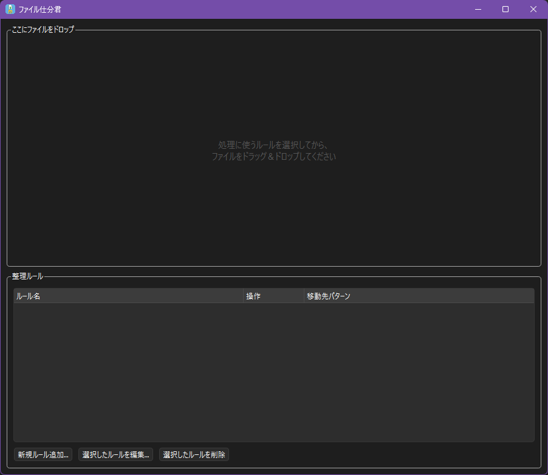
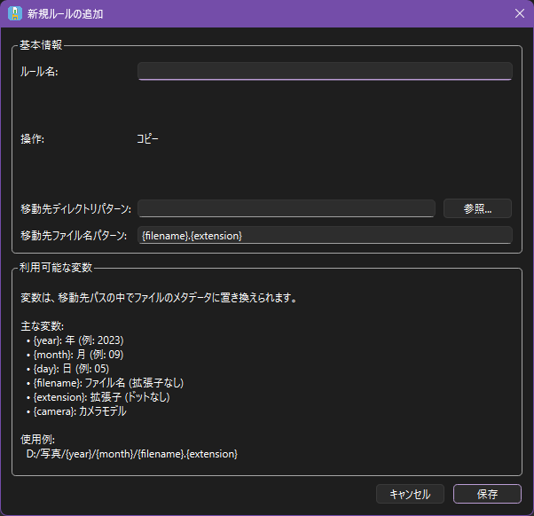

# ファイル仕分君

ファイル仕分君は、ファイルのメタデータ（画像のEXIF情報、ファイルシステム属性など）に基づいて、
ファイルを自動的に整理するデスクトップアプリケーションです。

## 使い方

1. 新規ルール追加
    

2. ディレクトリパターン、ファイル名パターンを設定して保存する。
    

3. ファイルをドラッグアンドドロップする。

## ローカルでのビルド

### 前提条件

-   Python 3.9以上

### セットアップ

```bash
pip install -r requirements.txt
```

### 実行可能ファイルのビルド

Nuitkaを使用して単一の実行可能ファイルをビルドします。

```bash
python -m nuitka --standalone --onefile --enable-plugin=pyside6 --windows-console-mode=disable --output-dir=dist --output-filename=FileShiwakeKun.exe --windows-icon-from-ico=icon.ico --assume-yes-for-downloads main.py
```

### 一時的な実行

```bash
python main.py
```
